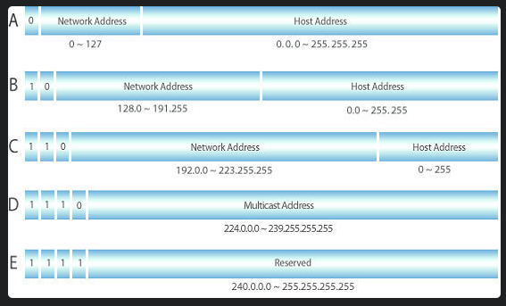

# cidr-calculator
- simple cidr calculator
- visualization

# web stack
- BE : golang, gin
- FE : react


## Subnet
- Before to know CIDR, understanding of subnet should be succeeded.
- Subnet is a small seperated network from one network
- Partitioning a network to create subnets is called as `subnetting`.
- It allows to break an IP allocation range into smaller Units.

## Subnet Mask
- It is supposed to categorize between Network Id and Host Id from Ip address.
- Written as 32-bit binary number, just like an IP address.
- The difference between IP Address is that it is consists of consecutive 1 and 0.
- means that 11111111.11111111.11111100.00000000 can only have consecutive or non-consecutive 1's.

### Prefix expression
- Using bit expression, subnet masks can be represented in an even more simplified way than above. 
- If IP address is 192.168.0.1/24, then the `/24` is representing subnet mask.
- `/24` means that there are 24 1's in the 32 bits, starting from the front and working backwards.
- -> `/24` → 11111111.11111111.11111111.00000000
- The original way of representing subnet 255.255.255.0 is converted as /24, the number of bits that correspond to the network.

```
For instance it abbreviate 192.168.1.17 255.255.255.0 to `192.168.1.17/24`. how awesome it is.
```

## What is CIDR
- CIDR stands for Classless Inter-Domain Routing.
- Classless means there's no network categorizing by class as below table.

- this is network categorizing system before CIDR came along.


## Purpose of CIDR
- To get the IP address `range`.
- 